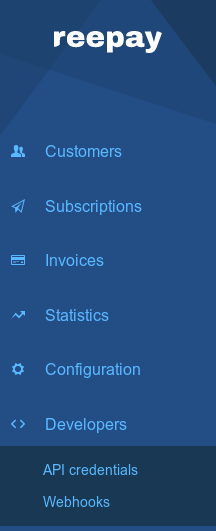
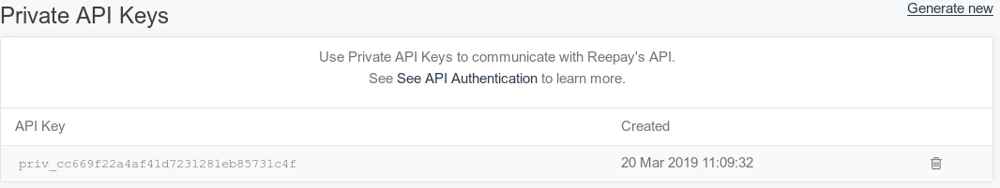
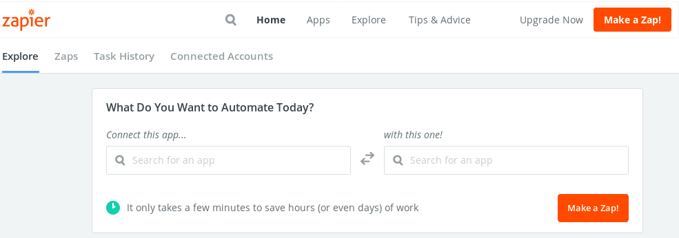

# Reepay-zap

This is a [Zapier](https://zapier.com/) application made for [Reepay](https://reepay.com/).

The purpose of the application is giving their users point and click gui for automation, so they can solve tedius task easily.

## Usage

This is a little guide on how to use the application, there is an important disclaimer at the bottom we recommend you start by reading.

### Reepay setup

First of all you need to be signed up on Reepay, and have a account. Then you need to select the account you want to setup a Zapier on.

click on 'API credentials'

Here you should see 2 types of keys, a public and a private key. What we are interrested in is the private type.

You should be able to see a clickable text called 'Generate new', click this. You should now be presented with something like this

This should make you a API key, you should save this for the time being, but keep it private since it can give access to you customer data. 

### Zapier setup

First of all you need to be signed up on Zapier. Depending on how big and advanced you want your Zapier automation to be you will need different tier of subscriptions.

After that you will need to get invited to use the Reepay zap, here is a [invite link](https://zapier.com/developer/public-invite/31285/65590962c705bd0ec27d5480070e6fdd/) for now until it gets published. 

You need to make a new zap which you can do by clicking on 'Make a Zap!'

You are now supposed choose a Trigger App, here you should select Reepay, and then at trigger event you want to select Resthook.

If you already have connected a Reepay account with your private API key before, now select that account or choose to add a new one, this will open a popup window where it ask permission to access your Reepay Account. Now its time to dig the API key from earlier back up, and put it in the API Key field and click 'Yes, Continue'. 

Now you need to select what kind of information you want, there is help text explaining the fields with a link to further information about the fields to select.

Once you are done with this you will need to test the part we just setup, please click on the test & review if you wanna see the output of the selected data or test & continue if you trust you did it right. We would recommend test & review just for good sake.

Now select the app you want to integrate with and then fill in the blanks!

## DISCLAIMER

IF YOU BY ANY CHANCE GET YOUR PRIVATE KEY LEAKED WE RECOMMEND YOU TO DELETE IT AND GENERATE A NEW ONE. 

DELETION OF A KEY CAN BE DONE BY PRESSING THE TRASHCAN ICON NEXT TO KEY. YOU THEN NEED TO REPLACE ALL THE PLACES YOU USE YOUR PRIVATE KEY SO THEY CAN FUNCTION AGAIN!

WE ARE NOT RESPONSIBLE FOR YOU NOT HANDLING YOUR API KEY SAFELY AND CANNOT BE HELD LIABLE FOR ANY LOSES OF ANY KIND.
